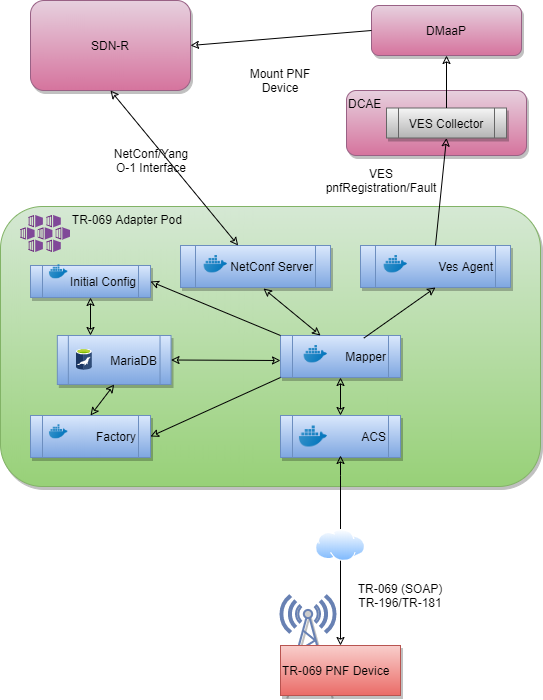

.. This work is licensed under a Creative Commons Attribution 4.0 International License.
.. SPDX-License-Identifier: CC-BY-4.0
.. Copyright (C) 2020 highstreet technologies and CommScope Inc.

TR069 Adapter Overview
======================================

The O-RAN SC OAM TR069 Adapter converts BBF-TR069 management interface to 
O-RAN OAM Interface Specification (O1-interface). 

The project follows the O-RAN Architecture, O-RAN OAM Architecture and OAM
interface specification as publiched by O-RAN Working Group1. 

Project Resources
-----------------

The source code is available from the Linux Foundation Gerrit server:

    `<https://gerrit.o-ran-sc.org/r/admin/repos/oam/tr069-adapter>`_

The build (CI) jobs are in the Linux Foundation Jenkins server:

    `<https://jenkins.o-ran-sc.org/view/oam/>`_

Issues are tracked in the Linux Foundation Jira server:

    `<https://jira.o-ran-sc.org/projects/OAM/>`_

Project information is available in the Linux Foundation Wiki:

    `<https://wiki.o-ran-sc.org/display/OAM/TR069+Adapter>`_

Scope
-----

The TR069 Adapter enables any TR-069 compliant device to be managed in the 
ONAP Environment by translating TR-069 messages (SOAP) to O-RAN O1 interface 
messages for NetConf/YANG, VES and vice versa. The TR-069 Adapter also 
supports translation of object models between TR Models (TR-196, TR-181) 
to  O-RAN O1 interface Yang Models.

TR-069Adapter Overview
----------------------

The following image shows how the BBF-TR069 Device, TR-069Adapter, SDN-R, and DMaap are connected.Each component depicted in the image is briefly described further below:

Maria DB
--------

The Maria DB container instance is used to support data persistence for the TR-069Adapter, such as Factory Table, Initial PnP Config Table, TR-069 Session and Device Connection Request URL information.

ACS
---

The Auto Configuration Service (ACS) Module is used to communicate with the Device using the TR-069 protocol.

Factory
-------

This module supports Rest APIs to authenticate Device TR-069 sessions using basic authentication. It also supports REST APIs to import a Factory Equipment  file which contains Device authentication information. 

Initial Config
--------------

This module supports importing 3GPP Config XML for Device. The configurations from XML are used to provision as Initial PnP Parameters to devices as part of BootStrap. This module also supports REST APIs to import Config XML which contains Device Initial PnP Configurations. The initial PnP Parameters are optional and could be used to emulate PnP using TR-069Adapter.

Mapper
------

The main function of this mapper is to map the request between NETCONF server and ACS (conversion of NETCONF protocol specific message to TR-069 message and vice versa) and to forward notifications to the VES Notifier.

NETCONF Server
--------------

A NETCONF compliant server is used to communicate to SDN-R’s NetConf Client. It internally uses the Yang Model built based on TR-196 and TR-181. 

VES Notifier
------------
Any notification from the device sent through TR-069Adapter and Mapper, is forwarded to VES by this component.
